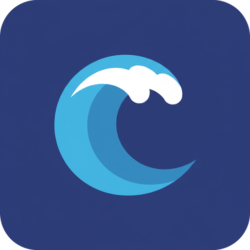

<p align="center"></p>

# OceanToken plugins for Codex and Claude Code

[OceanToken](https://oceantoken.ai) is one account for 500+ AI models: GPT, Claude, Gemini,
DeepSeek and Qwen for text; GPT Image, Seedream, Recraft and Gemini for images; Seedance, Veo,
Sora and Wan for video; plus text-to-speech and transcription. This plugin brings all of it into
your coding agent. Your agent can find a model, check what it costs, generate the asset, and save
it into your project.

## What your agent gets

| Tool | What it does |
|---|---|
| `search_models` | Search the catalog by name, type, publisher, capability and price. |
| `get_model` | Pricing, limits, and the sizes, durations and inputs a model accepts. |
| `estimate_cost` | What a request will cost before it runs, and whether your balance covers it. |
| `generate_image` | Text-to-image and image edits, with previews and download links. |
| `create_video` + `get_job` | Video from text, from a first (and last) frame, or from reference media. |
| `generate_speech` | Voice-overs and narration. |
| `transcribe_audio` | Transcripts and SRT/VTT subtitles. |
| `ask_model` | Hand a sub-task to another model: a cheaper one, or a second opinion. |
| `upload_file` | Use local files as references. |
| `get_account` | Balance and a top-up link. |

Three skills teach the agent how to use them well:

- `oceantoken-media`: produce images, video and audio for a project.
- `oceantoken-models`: choose, price and delegate.
- `oceantoken-setup`: run Codex or Claude Code itself on OceanToken, or wire up your app.

## Install

You need an OceanToken account ([sign up](https://app.oceantoken.ai/ui/signup/)) with some credit.

### Codex

```bash
codex plugin marketplace add NextFormAI/oceantoken-plugins
codex plugin add oceantoken@oceantoken
codex mcp login oceantoken      # opens the OceanToken sign-in page
```

In the Codex app you can also add the marketplace, then install **OceanToken** from the Plugins
panel and sign in when asked.

### Claude Code

```text
/plugin marketplace add NextFormAI/oceantoken-plugins
/plugin install oceantoken@oceantoken
/mcp                             # pick "plugin:oceantoken:oceantoken" and authenticate
```

### Any other MCP client

The server is `https://mcp.oceantoken.ai/mcp` (streamable HTTP). It supports OAuth with dynamic
client registration, so most clients just need the URL. To use an API key instead, send it as a
bearer token:

```bash
# Codex, without the plugin
export OCEANTOKEN_API_KEY=sk-...
codex mcp add oceantoken --url https://mcp.oceantoken.ai/mcp --bearer-token-env-var OCEANTOKEN_API_KEY

# Claude Code, without the plugin
claude mcp add --transport http oceantoken https://mcp.oceantoken.ai/mcp \
  --header "Authorization: Bearer $OCEANTOKEN_API_KEY"
```

```json
{
  "mcpServers": {
    "oceantoken": { "type": "http", "url": "https://mcp.oceantoken.ai/mcp" }
  }
}
```

## Signing in

The sign-in page offers two ways to connect:

- **Sign in**: your OceanToken email and password. This creates an API key for the connecting
  app, which you can see and revoke under **API keys** in the console.
- **API key**: paste a key you already have. Give it a credit limit if you want a cap for the
  agent.

Revoking the key disconnects the app immediately.

## Costs

You pay the model's usage from your prepaid OceanToken balance, at the prices on the
[Models page](https://app.oceantoken.ai/ui/model_hub/). Ask your agent for an estimate first
(`estimate_cost`). Video jobs place a small hold when they start and charge the actual cost when
they finish. Failed jobs are not charged.

## Privacy and terms

Prompts and files go to the model you choose, through OceanToken, to produce your result.
Generated files are stored in your OceanToken storage and shared as time-limited links. See the
[privacy policy](https://app.oceantoken.ai/legal/privacy) and [terms](https://app.oceantoken.ai/legal/terms).

## Support

Open an [issue](https://github.com/NextFormAI/oceantoken-plugins/issues). OceanToken is a
product of NextForm LLC.
